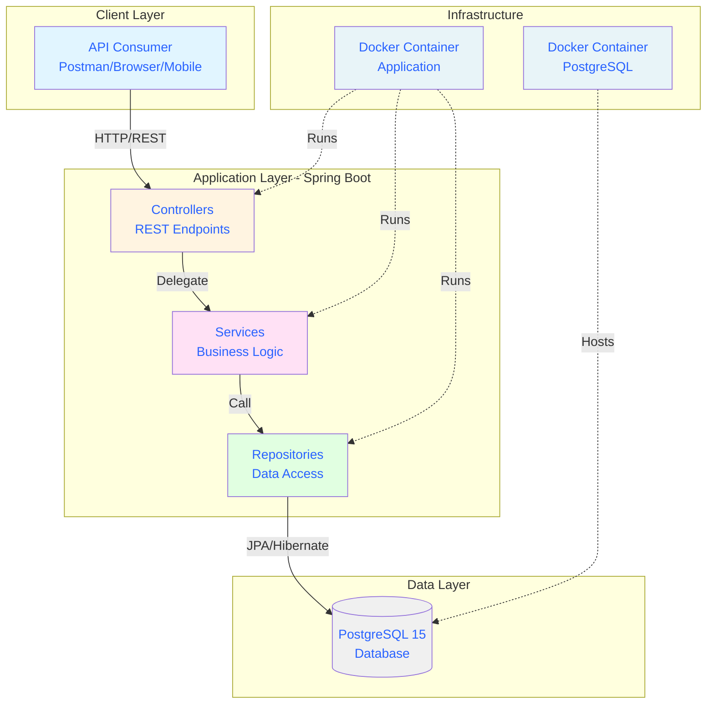

# Library Management API


> **REST API for library book loan management system** built with Spring Boot, PostgreSQL, Docker, and automated CI/CD pipeline.

---

## 🎯 Project Highlights

- ✅ **Full CRUD Operations** for Books, Users, and Loans
- ✅ **Automated Testing** with 98% code coverage (JaCoCo + Mockito)
- ✅ **CI/CD Pipeline** with GitHub Actions
- ✅ **Containerized** with Docker and Docker Compose
- ✅ **Security Scanning** with Trivy
- ✅ **Database Migrations** with JPA/Hibernate
- ✅ **Input Validation** with Jakarta Bean Validation
- ✅ **RESTful Design** following best practices

---

## Architecture



### Tech Stack

| Layer | Technology |
|-------|-----------|
| **Backend** | Spring Boot 4.0.1, Java 17 |
| **Database** | PostgreSQL 15 |
| **ORM** | Spring Data JPA / Hibernate |
| **Testing** | JUnit 5, Mockito, JaCoCo |
| **Build Tool** | Maven |
| **Containerization** | Docker, Docker Compose |
| **CI/CD** | GitHub Actions |
| **Security** | Trivy vulnerability scanning |
| **Utilities** | Lombok, Bean Validation |

---

## Quick Start

### Configuration Files Overview

| File | Purpose | Database | When Used |
|------|---------|----------|-----------|
| `application.properties` | Local development | PostgreSQL (localhost:5432) | `./mvnw spring-boot:run` |
| `application-docker.properties` | Docker environment | PostgreSQL (container) | `docker-compose up` |
| `application-test.properties` | Testing/CI | H2 (in-memory) | `./mvnw test` or GitHub Actions |

### Prerequisites

- **Docker & Docker Compose** (recommended)
- Java 17+ (if running without Docker)
- Maven 3.x (if running without Docker)

### Option 1: Run with Docker (Recommended)

```bash
# Clone the repository
git clone https://github.com/CandoJhon/biblioteca-api.git
cd biblioteca-api

# Start all services
docker-compose up -d

# Verify application is running
curl http://localhost:8080/api/health

# View logs
docker-compose logs -f app

# Stop services
docker-compose down
```

#### Docker Compose Architecture

The `docker-compose.yml` orchestrates two services:

```yaml
  app:
    build: .
    container_name: biblioteca-api
    ports:
      - "8080:8080"
    environment:
      SPRING_PROFILES_ACTIVE: docker  # ← Uses application-docker.properties
    depends_on:
      postgres:
        condition: service_healthy    # ← Waits for DB to be ready
```

**Key Features:**
- **Health checks**: Application waits for PostgreSQL to be ready
- **Networking**: Services communicate via Docker network
- **Isolated**: No conflicts with host system
- **Reproducible**: Same environment everywhere

### Option 2: Run Locally (Development)

```bash
# Ensure PostgreSQL is running
# Update src/main/resources/application.properties with your DB credentials

# Run the application
./mvnw spring-boot:run

# Or build and run the JAR
./mvnw clean package
java -jar target/biblioteca-api-0.0.1-SNAPSHOT.jar
```

---

## Testing

### Test Configuration Strategy

This project uses **different database configurations** for different environments:

#### **Development Environment** (`application.properties`)
Uses PostgreSQL running in Docker for local development:
```properties
spring.datasource.url=jdbc:postgresql://localhost:5432/biblioteca
spring.datasource.username=postgres
spring.datasource.password=postgres123
```

#### **Test Environment** (`application-test.properties`)
Uses **H2 in-memory database** for fast, isolated testing:
```properties
spring.datasource.url=jdbc:h2:mem:testdb;MODE=PostgreSQL
spring.datasource.driver-class-name=org.h2.Driver
spring.datasource.username=sa
spring.datasource.password=

spring.jpa.hibernate.ddl-auto=create-drop
spring.jpa.properties.hibernate.dialect=org.hibernate.dialect.H2Dialect
```

**Why H2 for testing?**
- **Fast**: In-memory database, no external dependencies
- **Isolated**: Each test run starts with clean state
- **CI/CD friendly**: No need to spin up PostgreSQL in GitHub Actions
- **PostgreSQL compatible**: H2's PostgreSQL mode emulates most features

#### **Docker Environment** (`application-docker.properties`)
Uses PostgreSQL container within Docker network:
```properties
spring.datasource.url=jdbc:postgresql://postgres:5432/biblioteca
spring.datasource.username=postgres
spring.datasource.password=postgres123
```

### Run All Tests

```bash
./mvnw clean test
```

Tests automatically use the `test` profile with H2 database via `@ActiveProfiles("test")` annotation.

### Generate Coverage Report

```bash
./mvnw jacoco:report
```

Open the report: `target/site/jacoco/index.html`

### Test Coverage Summary

- **Services Layer**: 98% coverage
- **Overall Project**: 65% coverage
- **Strategy**: Focus on business logic testing, not POJOs

### Testing Architecture

```
Unit Tests (Mockito)
├── BookServiceTest     → Tests book business logic
├── UserServiceTest     → Tests user management
└── LoanServiceTest     → Tests loan workflows

Integration Tests (H2)
└── BibliotecaApiApplicationTests → Tests Spring context loads
```

### Environment Configuration Matrix

| Environment | Profile | Database | Connection | Config File |
|-------------|---------|----------|------------|-------------|
| **Local Dev** | default | PostgreSQL 15 | `localhost:5432` | `application.properties` |
| **Docker** | docker | PostgreSQL 15 | `postgres:5432` | `application-docker.properties` |
| **Testing/CI** | test | H2 in-memory | `mem:testdb` | `application-test.properties` |

### Required Dependencies for Testing

The following dependencies are configured in `pom.xml`:

```xml

<!-- H2 Database for in-memory testing 
<dependency>
    <groupId>com.h2database</groupId>
    <artifactId>h2</artifactId>
    <scope>test</scope>
</dependency>
-->

<!-- Spring Boot Test Starter (includes JUnit 5, Mockito) 
<dependency>
    <groupId>org.springframework.boot</groupId>
    <artifactId>spring-boot-starter-test</artifactId>
    <scope>test</scope>
</dependency>
-->

<!-- JaCoCo for code coverage 
<plugin>
    <groupId>org.jacoco</groupId>
    <artifactId>jacoco-maven-plugin</artifactId>
    <version>0.8.11</version>
</plugin>
-->

```

---

## API Documentation

### Health Check

```http
GET /api/health
```

Returns application status and statistics.

### Books Endpoints

| Method | Endpoint | Description |
|--------|----------|-------------|
| `GET` | `/api/books` | List all books |
| `GET` | `/api/books/{id}` | Get book by ID |
| `GET` | `/api/books/available` | List available books |
| `GET` | `/api/books/search?title={title}` | Search by title |
| `GET` | `/api/books/search?author={author}` | Search by author |
| `POST` | `/api/books` | Create new book |
| `PUT` | `/api/books/{id}` | Update book |
| `DELETE` | `/api/books/{id}` | Delete book |

### Users Endpoints

| Method | Endpoint | Description |
|--------|----------|-------------|
| `GET` | `/api/users` | List all users |
| `GET` | `/api/users/{id}` | Get user by ID |
| `GET` | `/api/users/active` | List active users |
| `GET` | `/api/users/search?name={name}` | Search by name |
| `POST` | `/api/users` | Create new user |
| `PUT` | `/api/users/{id}` | Update user |
| `DELETE` | `/api/users/{id}` | Delete user |

### Loans Endpoints

| Method | Endpoint | Description |
|--------|----------|-------------|
| `GET` | `/api/loans` | List all loans |
| `GET` | `/api/loans/{id}` | Get loan by ID |
| `GET` | `/api/loans/active` | List active loans |
| `GET` | `/api/loans/overdue` | List overdue loans |
| `GET` | `/api/loans/user/{userId}` | Get loans by user |
| `GET` | `/api/loans/book/{bookId}` | Get loans by book |
| `POST` | `/api/loans` | Create new loan |
| `POST` | `/api/loans/{id}/return` | Return book |

---

## Example API Requests

### Create a Book

```bash
curl -X POST http://localhost:8080/api/books \
  -H "Content-Type: application/json" \
  -d '{
    "title": "Clean Code",
    "author": "Robert C. Martin",
    "isbn": "978-0132350884",
    "publicationYear": 2008,
    "editorial": "New Code",
    "available": true
  }'
```

### Create a User

```bash
  curl -X POST http://localhost:8080/api/users \
  -H "Content-Type: application/json" \
  -d '{
    "name": "John",
    "lastName": "Cando",
    "email": "john_jm@outlook.com",
    "phone": "+592-555-1234",
    "active": true
  }'
```

### Create a Loan

```bash
curl -X POST http://localhost:8080/api/loans \
  -H "Content-Type: application/json" \
  -d '{
    "book": {"id": 1},
    "user": {"id": 1},
    "expectReturnDate": "2026-02-01"
  }'
```

### Return a Book

```bash
curl -X POST http://localhost:8080/api/loans/1/return
```

---

## 🗄️ Database Schema

```sql
books
├── id (PK)
├── title
├── author
├── isbn (unique)
├── publication_year
├── editorial
├── available
└── registration_date

users
├── id (PK)
├── name
├── last_name
├── email (unique)
├── phone
├── registration_date
└── active

loans
├── id (PK)
├── book_id (FK → books)
├── user_id (FK → users)
├── loan_date
├── expect_return_date
├── actual_return_date
└── status (ACTIVE, RETURNED, EXPIRED)
```

---

## 🎯 Key Design Decisions

### Why Spring Boot?
Enterprise-grade framework with robust ecosystem for building production-ready REST APIs with minimal configuration.

### Why PostgreSQL?
ACID-compliant relational database ideal for managing complex relationships between books, users, and loans.

### Why Docker?
Ensures consistent development, testing, and deployment environments across different systems.

### Testing Strategy
- **Unit tests** for business logic (Services layer)
- **Integration tests** for database operations
- **H2 in-memory database** for fast CI/CD testing
- Target: 60%+ code coverage focusing on critical paths

### CI/CD Pipeline
Automated workflow that:
- Runs all tests on every commit
- Generates code coverage reports
- Builds and publishes Docker images
- Scans for security vulnerabilities
- Prevents broken code from being merged

---

## 📁 Project Structure

```
biblioteca-api/
├── src/
│   ├── main/
│   │   ├── java/com/biblioteca/api/
│   │   │   ├── controller/       # REST endpoints
│   │   │   ├── service/          # Business logic
│   │   │   ├── repository/       # Data access layer
│   │   │   ├── model/            # JPA entities
│   │   │   └── BibliotecaApiApplication.java
│   │   └── resources/
│   │       ├── application.properties         # Default config (local dev)
│   │       └── application-docker.properties  # Docker environment config
│   └── test/
│       ├── java/com/biblioteca/api/
│       │   └── service/          # Service unit tests (Mockito)
│       └── resources/
│           └── application-test.properties    # Test config (H2 database)
├── .github/
│   └── workflows/
│       └── ci-cd.yml             # GitHub Actions CI/CD pipeline
├── docker-compose.yml            # Multi-container orchestration
├── Dockerfile                    # Application container image
└── pom.xml                       # Maven dependencies & build config
```

### Configuration Files Explained

#### `application.properties` (Local Development)
```properties
# PostgreSQL running on localhost (via Docker or native)
spring.datasource.url=jdbc:postgresql://localhost:5432/biblioteca
spring.datasource.username=postgres
spring.datasource.password=postgres123

# JPA/Hibernate configuration
spring.jpa.hibernate.ddl-auto=update
spring.jpa.show-sql=true
```
**Usage**: Default profile when running locally with `./mvnw spring-boot:run`

---

#### `application-docker.properties` (Docker Compose)
```properties
# PostgreSQL service name in Docker network
spring.datasource.url=jdbc:postgresql://postgres:5432/biblioteca
spring.datasource.username=postgres
spring.datasource.password=postgres123

# Same JPA configuration
spring.jpa.hibernate.ddl-auto=update
spring.jpa.show-sql=true
```
**Usage**: Activated in `docker-compose.yml` with `SPRING_PROFILES_ACTIVE=docker`

**Key difference**: Uses `postgres` (service name) instead of `localhost`

---

#### `application-test.properties` (Testing/CI)
```properties
# H2 in-memory database with PostgreSQL compatibility
spring.datasource.url=jdbc:h2:mem:testdb;MODE=PostgreSQL;DATABASE_TO_LOWER=TRUE
spring.datasource.driver-class-name=org.h2.Driver
spring.datasource.username=sa
spring.datasource.password=

# Create schema on startup, drop on shutdown
spring.jpa.hibernate.ddl-auto=create-drop
spring.jpa.show-sql=false
spring.jpa.properties.hibernate.dialect=org.hibernate.dialect.H2Dialect
```
**Usage**: Activated in tests with `@ActiveProfiles("test")` annotation

**Why H2?**
- No external database needed in CI/CD
- Faster test execution (~5x faster than real PostgreSQL)
- Isolated test environment

---

### Spring Profiles Flow

```
┌─────────────────────────────────────────────────────────────┐
│                    APPLICATION START                         │
└──────────────────────┬──────────────────────────────────────┘
                       │
          ┌────────────┴────────────┐
          │  Which profile active?  │
          └────────────┬────────────┘
                       │
        ┌──────────────┼──────────────┐
        │              │              │
        ▼              ▼              ▼
   ┌────────┐    ┌─────────┐   ┌─────────┐
   │ default│    │  docker │   │   test  │
   │(local) │    │ (compose)│   │  (CI)   │
   └────┬───┘    └─────┬───┘   └────┬────┘
        │              │             │
        ▼              ▼             ▼
   PostgreSQL     PostgreSQL      H2 DB
   localhost      container       in-memory
```

---

---

## Development

### Run Tests in Watch Mode

```bash
./mvnw spring-boot:test-run
```

### Build Docker Image Locally

```bash
docker build -t biblioteca-api:local .
```

### Access PostgreSQL Database

```bash
docker compose exec postgres psql -U postgres -d biblioteca
```

---

## 🚦 CI/CD Pipeline

The project uses **GitHub Actions** for automated CI/CD:

### Pipeline Stages

1. **Test** (2-3 min)
    - Checkout code
    - Set up Java 17
    - Run all unit tests
    - Generate JaCoCo coverage report
    - Upload coverage to Codecov

2. **Build** (1-2 min)
    - Compile application
    - Package as JAR file
    - Upload build artifact

3. **Docker** (3-4 min)
    - Build Docker image
    - Publish to GitHub Container Registry
    - Run Trivy security scan
    - Report vulnerabilities

**Total Duration**: ~7-10 minutes per run

### View Pipeline Status

Check the Actions tab: [https://github.com/CandoJhon/biblioteca-api/actions](https://github.com/CandoJhon/biblioteca-api/actions)

---

## Security

- **Trivy scanning** for container vulnerabilities
- **Input validation** with Jakarta Bean Validation
- **SQL injection prevention** with JPA/Hibernate
- **Dependency updates** monitored via Dependabot (optional)

---

## Learning Resources

This project demonstrates:

- RESTful API design principles
- Test-Driven Development (TDD) practices
- Containerization best practices
- CI/CD automation
- Database schema design
- Spring Boot application architecture

---

## Future Enhancements

- [ ] Authentication & Authorization (Spring Security + JWT)
- [ ] API Documentation (Swagger/OpenAPI)
- [ ] Pagination & Filtering for list endpoints
- [ ] Advanced search with multiple criteria
- [ ] Email notifications for overdue loans
- [ ] Book reservation system
- [ ] Fine calculation for late returns
- [ ] Deployment to cloud (AWS/Azure/GCP)

---

## 📄 License

This project is licensed under the MIT License - see the [LICENSE](LICENSE) file for details.

---

## 👤 Author

**Jhon Cando**

- 🌐 LinkedIn: [linkedin.com/in/jhon-cando](https://linkedin.com/in/jhon-cando)
- 💻 GitHub: [@CandoJhon](https://github.com/CandoJhon)
- 📧 Email: john_jm@outlook.com

---

Contributions, issues, and feature requests are welcome!

1. Fork the repository
2. Create your feature branch (`git checkout -b feature/AmazingFeature`)
3. Commit your changes (`git commit -m 'Add some AmazingFeature'`)
4. Push to the branch (`git push origin feature/AmazingFeature`)
5. Open a Pull Request

---

## 🙏 Acknowledgments

- Spring Boot community for excellent documentation
- PostgreSQL team for a robust database system
- Docker for simplifying deployment workflows